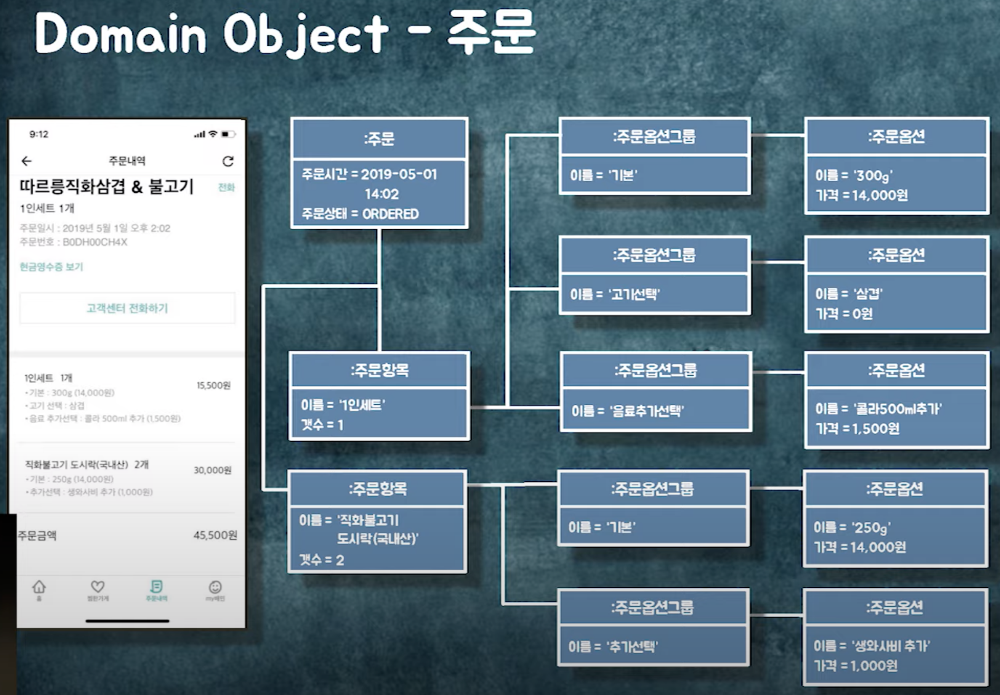

# 우아한 객체지향 클론코딩
> [우아한테크세미나] 190620 우아한객체지향 by 우아한형제들 개발실장 조영호님  

[https://www.youtube.com/watch?v=dJ5C4qRqAgA](https://www.youtube.com/watch?v=dJ5C4qRqAgA)

## 도메인 - 가게 & 메뉴

## 도메인 - 주문

## 주문 Validation

## 협력 설계

## 설계를 진화시키기 위한 출발점
- 코드 작성 후 의존성 관점에서 설계 검토

### 중간 객체 사용하기

### 객체 분리/묶기
- 함께 생성되고 함께 삭제되는 객체들을 함께 묶어라
- 도메인 제약사항을 공유하는 객체들을 함께 묶어라
- 가능하면 분리해라

- 경계 밖의 객체는 `ID`를 이용해 접근
- 분리하고 나서의 그룹이 `조회 경계`, `트랜잭션 단위`